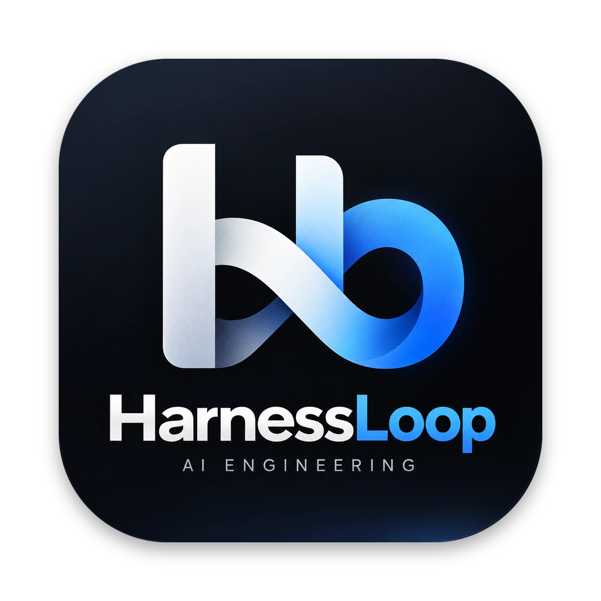

<p align="center"></p>

# HarnessLoop

여러 코딩 에이전트(Codex, OpenCode Kimi, Claude Code, Google Antigravity)를 한 명령으로 병렬 실행하는 macOS 하네스입니다. 모델이 사용량 한도에 걸리면 다음 모델로 자동 전환합니다.

- **엔진** `engine/harness.py`: Python 표준 라이브러리만 사용. 어떤 Git 프로젝트에서도 동작.
- **앱** `HarnessLoop.app`: SwiftUI. 프로젝트 선택, 작업 지시, 모델 on/off, 진행 상황·로그·patch 확인, 적용.

## 동작 방식

```
명령 → 스냅샷 → Claude 계획 → 워커 병렬 실행 (격리된 worktree) → (보안 리뷰) → Claude 리뷰 → 통합 → 검증 → 반복 → final.patch → 결과 요약 → Apply
```

1. 현재 작업 트리(커밋 안 된 파일 포함)를 스냅샷으로 뜹니다. HEAD, index, stash는 건드리지 않습니다.
2. 조율자(`claude`)가 작업을 1~4개로 나누고, 워커마다 겹치지 않는 수정 가능 경로를 정합니다.
3. 워커는 각자 별도 `git worktree`에서 병렬로 실행됩니다. 허용 경로 밖을 수정한 patch는 보류됩니다.
4. 보안 관련 변경이면 Claude가 patch를 리뷰합니다.
5. 조율자가 승인한 patch만 전용 통합 worktree에 반영합니다. 승인되지 않은 patch는 `rejected`로 표시됩니다.
6. 프로젝트에 `verify_command`가 있으면 통합된 결과에서 실행합니다. 실패하면 출력이 다음 라운드 피드백으로 넘어가고, 리뷰가 완료라고 해도 끝나지 않습니다. 필요하면 다음 라운드를 진행합니다(기본 최대 3라운드).
7. 결과는 `final.patch`로 남습니다. **Apply를 눌러야만 프로젝트 파일이 바뀝니다.**
   - run 도중 실제 프로젝트 파일이 바뀌면(에이전트가 worktree 밖을 수정했거나 직접 편집) 경고를 남깁니다. 그 파일이 patch와 겹치면 Apply가 거부되고, 되돌리는 `git restore` 명령을 안내합니다.
8. 요약 모델(`summary_role`, 기본 `luna`)이 최종 patch를 읽고 `report.md`를 씁니다: 결과, 변경 내용, 확인 방법, 남은 문제. 앱의 Summary 탭과 `status` 명령에서 볼 수 있습니다. 요약이 실패해도 patch는 그대로 적용할 수 있습니다.

## 역할과 fallback

| 역할 | 기본 모델 | 용도 | 한도 초과 시 fallback |
|---|---|---|---|
| `sol` | Codex `gpt-5.6-sol` (effort high) | 고난도 구현 | kimi → claude → antigravity |
| `luna` | Codex `gpt-5.6-luna` (effort max) | 빠른 구현, QA | kimi → antigravity → claude |
| `kimi` | OpenCode `kimi-for-coding` | 저비용 반복 작업, 문서 | luna → antigravity → claude |
| `claude` | Claude Code `opus` (effort high) | 계획·리뷰 (조율자), 보안 리뷰 | sol → luna → kimi → antigravity |
| `antigravity` | `agy` | UI·대안 구현 | kimi → luna → claude |

- 다음 모델로 넘어가는 조건: 사용량·쿼터·rate limit 오류, 모델 off, CLI 미설치.
- 한도에 걸린 모델은 그 run이 끝날 때까지 다시 시도하지 않습니다.
- Antigravity는 헤드리스 모드에서 셸 명령을 자동 거부합니다. `providers.antigravity.skip_permissions: true`로 모든 도구를 자동 승인할 수 있습니다(`--dangerously-skip-permissions`). 이때 `--sandbox`는 쓰지 않습니다(sandbox 안에서는 명령이 멈춤). 에이전트가 확인·격리 없이 셸 명령을 실행하므로 신뢰하는 프로젝트에서만 켜세요.
- 설정 파일은 `~/.ai-harness/config.json`입니다. 모델, on/off, fallback 순서, `max_rounds`, `max_workers`, `call_timeout_minutes`, `summary_role`(빈 문자열이면 요약 끔)을 여기서 바꿉니다.
- 효율 설정(기본 켜짐): `fast_path`는 워커가 1명이고 프로젝트에 `verify_command`가 있으면 조율자 리뷰 없이 통합한 뒤 검증 결과로 완료를 판단합니다. `focused_review`는 리뷰가 명령과 수용 기준만 보고 명세 밖 보강을 요구하지 않게 합니다. `prefer_single_worker`는 작은 작업을 워커 한 명에게 맡기게 합니다. `coordinator`로 계획·리뷰 모델을 바꿀 수 있습니다(기본 `claude`).

## 토큰 사용량

호출마다 AI별 토큰 사용량을 기록합니다. 앱의 run 화면에서 Tokens를 펼치면 모델별 호출 수·토큰·비용이, 작업 행에는 호출별 토큰이, Models 패널에는 이 프로젝트 전체 누적량이 보입니다. CLI는 `status`로 확인합니다.

| 모델 | 출처 | 제공 항목 |
|---|---|---|
| Claude | stream-json `result` 이벤트 | 입력·출력·캐시·비용(USD) |
| Codex (sol, luna) | 출력 끝의 `tokens used` | 합계만 |
| OpenCode Kimi | OpenCode 세션 DB(`~/.local/share/opencode/opencode.db`) | 입력·출력·캐시 |
| Antigravity | `--output-format json`의 `usage` | 입력·출력·캐시 |

직접 추가한 AI는 사용량을 알 수 없어 표시되지 않습니다.

## 벤치마크

하네스와 단일 AI(GPT, Claude 등)를 같은 문제로 비교합니다. 문제마다 숨긴 채점 테스트가 있어 정답률, 시간, 토큰, 비용을 표로 냅니다.

```bash
python3 engine/harness.py bench validate
python3 engine/harness.py bench --arms harness,sol,claude --trials 3
```

하네스 설정끼리 비교하거나 모델을 끌 수도 있습니다.

```bash
python3 engine/harness.py bench --arms harness,harness-classic,claude \
  --arm-config 'harness-classic={"fast_path": false, "focused_review": false}' \
  --config '{"providers": {"sol": {"enabled": false}}}'
```

문제 목록과 추가 방법은 [bench/README.md](bench/README.md)를 보세요.

## 다른 AI 추가

앱의 Models 패널에서 `+`로 에이전트 CLI를 추가하고, 연필 버튼으로 이름·모델·fallback 순서를 수정합니다(기본 모델은 삭제 불가). 설정은 `~/.ai-harness/config.json`에 저장되며 직접 편집해도 됩니다.

```json
"providers": {
  "gemini": {
    "label": "Gemini CLI", "enabled": true, "model": "",
    "command": ["gemini", "-p", "{prompt}", "--model", "{model}"],
    "read_args": ["--approval-mode", "plan"], "write_args": ["--yolo"],
    "stdin": false, "worker": true, "notes": "빠르고 저렴. 문서·반복 작업"
  }
},
"fallback": { "gemini": ["kimi", "claude"] }
```

- `{prompt}` `{model}` `{workdir}` `{message_file}`은 호출마다 채워집니다. 모델이 비어 있으면 `{model}`과 바로 앞의 플래그를 뺍니다. `stdin: true`면 프롬프트를 표준 입력으로 보냅니다.
- `read_args`는 계획·리뷰·요약 같은 읽기 호출에, `write_args`는 워커 수정 호출에 붙습니다. 하네스는 추가한 CLI의 읽기 전용 여부를 강제할 수 없으므로 그 CLI의 옵션을 넣으세요. 워커는 격리된 worktree에서 실행되고 경로 검사는 그대로 적용됩니다.
- 결과는 CLI가 출력한 내용이며, `{message_file}`에 쓰면 그 파일을 사용합니다.
- `worker: true`면 조율자가 `notes`를 보고 작업을 배정할 수 있습니다. 다른 모델의 fallback이나 `summary_role`로도 쓸 수 있습니다.

## 설치

필요 조건:
- macOS 14 이상, Git, Python 3.9 이상
- 사용할 에이전트 CLI 중 최소 하나 (로그인된 상태): `codex`, `opencode`, `claude`, `agy`

**Release에서 설치**

```bash
curl -fsSL https://raw.githubusercontent.com/HAHEONHWI/harnessAi/main/scripts/install.sh | bash
```

**소스에서 빌드** (Xcode 또는 Command Line Tools 필요)

```bash
scripts/build.sh
```

앱은 ad-hoc 서명만 되어 있고 공증(notarization)은 받지 않았습니다. zip을 직접 받았다면 먼저 `xattr -dr com.apple.quarantine "/Applications/HarnessLoop.app"`을 실행하세요.

## 사용

**앱**
1. 툴바 폴더 버튼으로 프로젝트를 선택합니다.
2. New Task(⌘N)를 누르고 명령을 입력합니다. 필요하면 대상 파일·폴더를 지정합니다.
3. 진행 상황을 지켜보고 Apply to project로 적용합니다.

**CLI**

```bash
harness=~/.ai-harness/bin/harness.py
$harness start --repo . --path src/api --path README.md "API 응답 캐싱 추가"
$harness status --repo .
$harness apply --repo . <run-id>
$harness config kimi off
```

| 명령 | 설명 |
|---|---|
| `start` / `run` | 백그라운드 / 포그라운드 실행 |
| `status`, `list` | 진행 상태, run 목록 |
| `stop <id>` | 실행 중지 |
| `apply <id>` | `final.patch`를 프로젝트에 적용 |
| `cleanup [--delete] <id>` | worktree 정리 (`--delete`면 run 폴더도 삭제) |
| `config [provider on\|off]` | 설정 보기, 모델 on/off |
| `init` | 기본 설정과 OpenCode 에이전트 설치 |

## 프로젝트별 설정

프로젝트에 `.ai-harness/config.json`을 두면 보호 경로와 검증 명령을 지정할 수 있습니다.

```json
{
  "protected_paths": ["templates", "output", ".local-settings.json"],
  "verify_command": "npm ci && npm test"
}
```

- `protected_paths`: 에이전트가 수정할 수 없는 경로.
- `verify_command`: 매 라운드 통합 후 결과를 검증하는 셸 명령(`zsh -lc`). 종료 코드 0이면 통과입니다. 통합 worktree에는 커밋되지 않은 의존성(`node_modules` 등)이 없으므로 설치 단계를 명령에 포함하세요. 검증이 만든 추적 파일은 patch에 들어가지 않도록 되돌립니다.

`.git`, `.env*`, `.ai-harness`, `.ssh`, `.aws`, `node_modules` 등은 항상 보호됩니다. run 기록은 `.ai-harness/runs/`에 저장되며, 엔진이 이 경로를 `.git/info/exclude`에 자동으로 추가합니다.

## 배포

`v*` 태그를 push하면 `.github/workflows/release.yml`이 universal 앱을 빌드해 GitHub Release에 `HarnessLoop-macOS.zip`을 올립니다.

```bash
git tag v0.1.0
git push origin v0.1.0
```

## 주의

- 에이전트는 각자의 CLI 계정과 요금제로 실행됩니다. Claude 호출에는 `max_budget_usd`(기본 $5)가 적용됩니다.
- 명령과 프롬프트는 외부 모델 API로 전송됩니다. 비밀 정보나 개인정보를 명령에 넣지 마세요.
